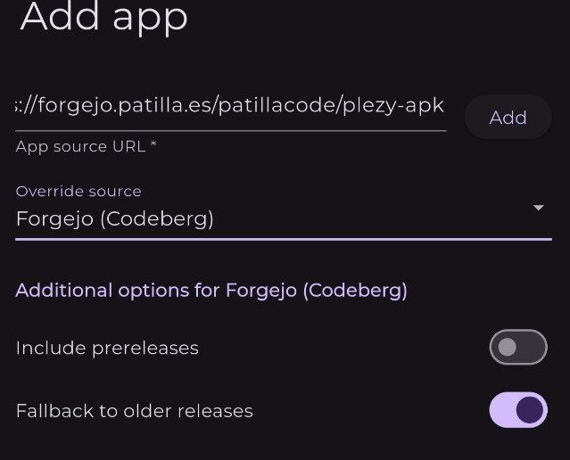

# plezy-apk-extractor

Mirrors [Plezy](https://github.com/edde746/plezy) releases with the arm64-v8a APK attached, so [Obtainium](https://github.com/ImranR98/Obtainium) can track updates automatically.

Since Plezy v1.13.0, Android assets ship as architecture-specific `.tar.gz` tarballs rather than APK files. This repo re-publishes each new release with the APK extracted from the tarball.

## Obtainium setup

Just click on the button below from your device to add this repo to Obtainium:

<div align="center">
    <a href="https://apps.obtainium.imranr.dev/redirect.html?r=obtainium://add/https://forgejo.patilla.es/patillacode/plezy-apk-extractor">
        
    </a>
</div>

Manually, set the source URL to this (or your) repo:

Remember to select **Forgejo (Codeberg)** as the override source:



New releases appear here within 24 hours of the upstream Plezy release.

---

## Self-hosting

### How it works

A cron job runs `extract.sh` on a schedule of your choice, which:

1. Fetches the latest release from the [upstream Plezy repo](https://github.com/edde746/plezy) via the GitHub API
2. Compares it against the last published version (stored in `.last_version`)
3. If a new version is found:
   - Downloads the `arm64-v8a` tarball
   - Extracts the APK from inside it
   - Creates a matching release on your Forgejo repo
   - Uploads the APK as a release asset
   - Sends a notification confirming the publish (Telegram and/or ntfy, if configured)
4. If already up to date, exits cleanly with a log entry
5. On any failure, sends a notification with the error details (Telegram and/or ntfy, if configured)

### Requirements

- `bash`, `curl`, `tar`, `jq`, [`just`](https://github.com/casey/just)
- A [Forgejo](https://forgejo.org) instance
- A Forgejo repository initialized with at least one commit (required for the releases API)

### Setup

**1. Clone this repo**

```bash
git clone <your-forgejo-instance>/your-user/plezy-apk-extractor.git
cd plezy-apk-extractor
```

**2. Configure**

```bash
cp .env.example .env
```

Edit `.env` with your values:

| Variable | Required | Description |
|---|---|---|
| `FORGEJO_TOKEN` | yes | Personal access token with `write:repository` scope |
| `FORGEJO_USER` | yes | Your Forgejo username |
| `FORGEJO_REPO` | yes | Forgejo repository name |
| `FORGEJO_URL` | yes | Your Forgejo instance URL (e.g. `https://forgejo.example.com`) |
| `TELEGRAM_TOKEN` | no | Telegram bot token — omit to disable Telegram notifications |
| `TELEGRAM_CHAT_ID` | no | Telegram chat ID — omit to disable Telegram notifications |
| `NTFY_URL` | no | ntfy server URL (e.g. `https://ntfy.example.com`) — omit to disable ntfy notifications |
| `NTFY_TOKEN` | no | ntfy access token |
| `NTFY_TOPIC` | no | ntfy topic to publish to (default: `plezy`) |

To generate a Forgejo token: **Settings → Applications → Generate Token** (scope: `write:repository`).

**3. Run it once manually**

```bash
just run
```

Check your Forgejo repo — a new release with the APK attached should appear.

**4. Set up the cron job**

Add to your crontab (`crontab -e`):

```
0 9 * * * /path/to/plezy-apk-extractor/extract.sh >> /path/to/plezy-apk-extractor/logs/plezy-apk-extractor.log 2>&1
```

Adjust the schedule to your preference. The `logs/` directory is created automatically on first run.

**5. (Optional) Set up log rotation**

To prevent the log file from growing indefinitely, create `/etc/logrotate.d/plezy-apk-extractor`:

```
/path/to/plezy-apk-extractor/logs/plezy-apk-extractor.log {
    size 10M
    rotate 3
    compress
    delaycompress
    missingok
    notifempty
    create 0644 your-user your-user
    dateext
    dateformat -%Y%m%d
}
```

### Usage

```bash
just run      # run extraction manually
just status   # show last published version vs latest upstream
just reset    # clear .last_version to force re-processing on next run
just logs     # tail the log file
```
